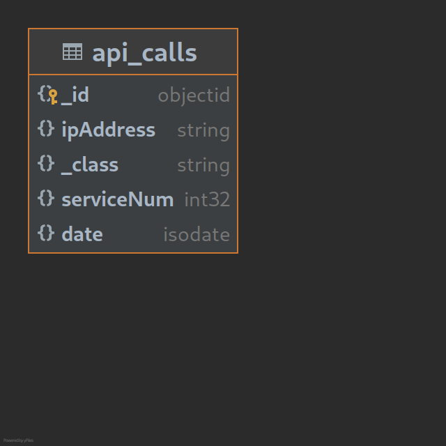
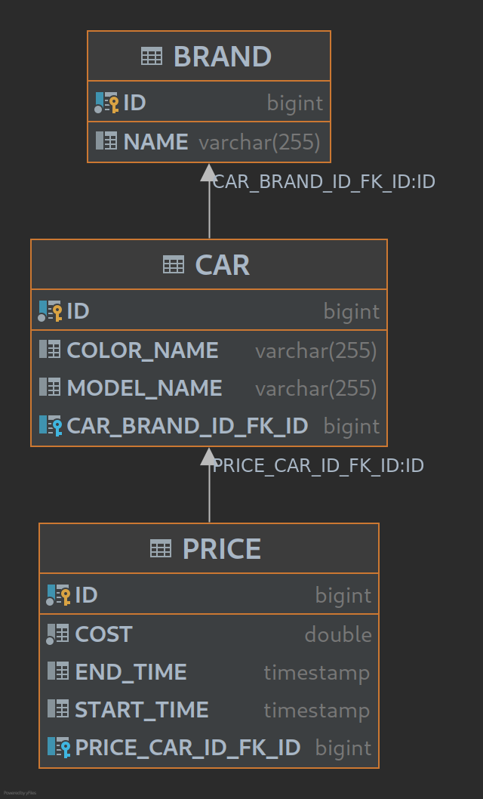

# Antonio Izquierdo Álvarez

## Resumen
Los servicios solicitados se han hecho y se han probado 
manualmente. Por cuestiones de tiempo (cosas de las 
vacunas), los test solo se han comentado su funcionamiento
y no se han implementado.

Puedes probarlos directamente con Postman o con el archivo 
"generated-requests.http" de IntelliJ donde se encuentran 
métodos GET hechos.

### Instalación de MongoDB
El proyecto necesita una base de datos MongoDB 5.0.2. Yo 
la he instalado a través de un contenedor. En mi caso 
usando Linux se instalé el administrador de contenedores 
Podman:
```
sudo dnf -y install podman
```
Después descargué la imágen de MongoDB (Seleccioné el 
servidor de DockerHub):
```
podman pull mongo:5.0.2
```
Después solo queda ejecutar el contenedor en el puerto. 
(Al reiniciar si no se ha configurado hay que volver a 
iniciar el contenedor):
```
podman run -d -p 27017:27017 --name mongodb mongo:5.0.2
```
Si lo necesitas, vuelve a iniciar la imágen con su ID:
```
podman start 472241ae19fe2d45e7868d7017e0b19cdadc673f12312f22ff531039b6ff36bc
```

Resultado:


### Base de Datos H2
Resultado de base de datos H2:
